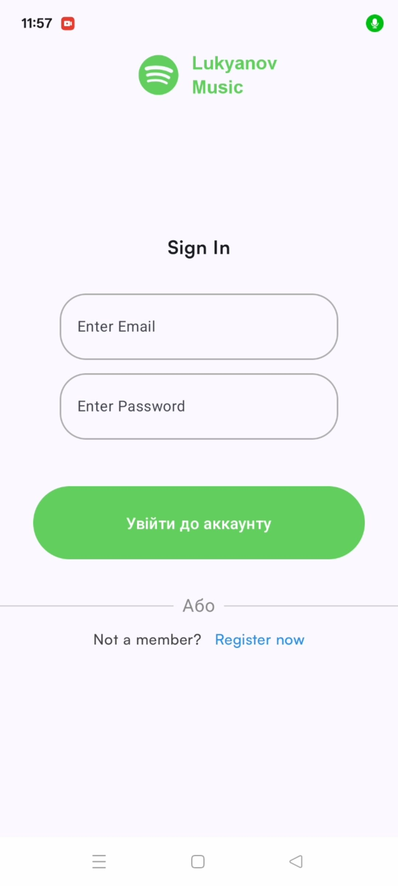
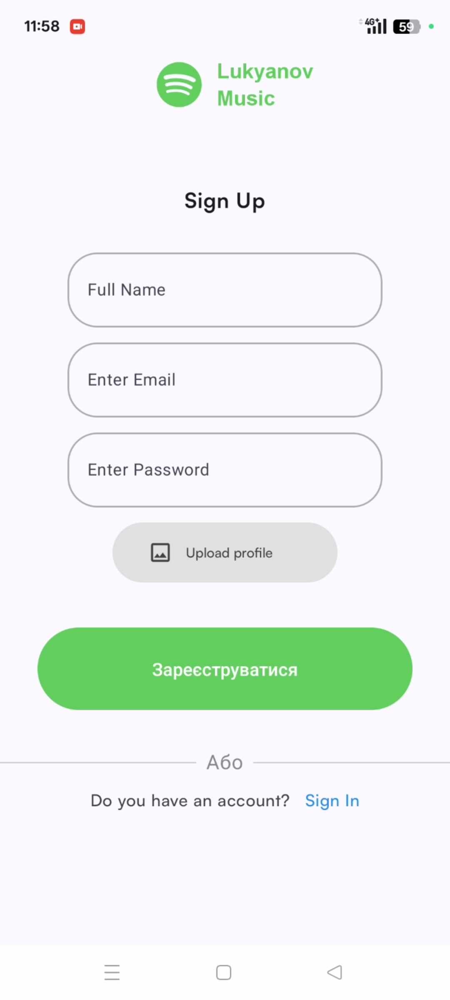
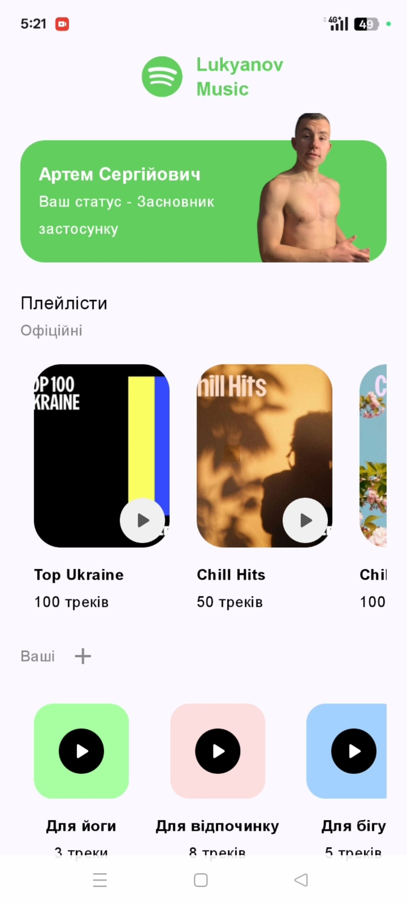
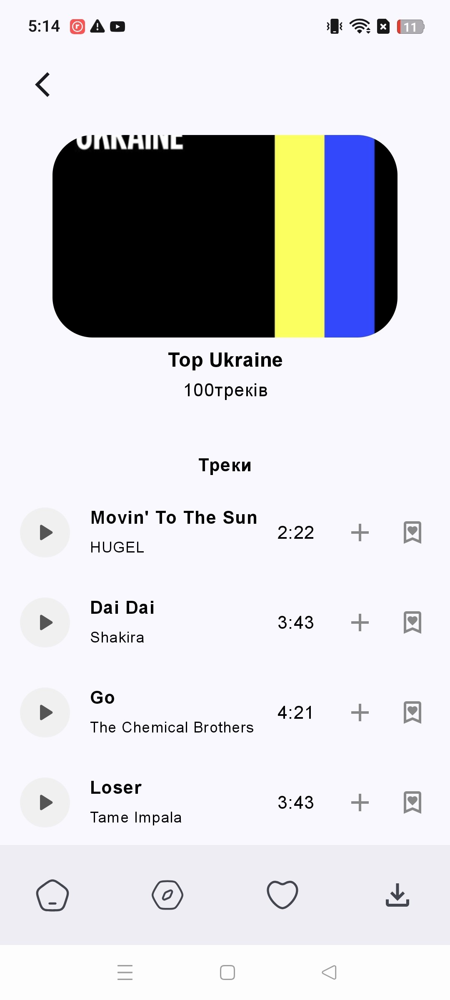
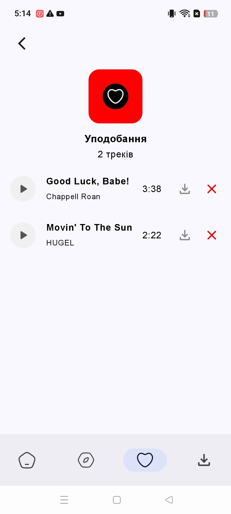
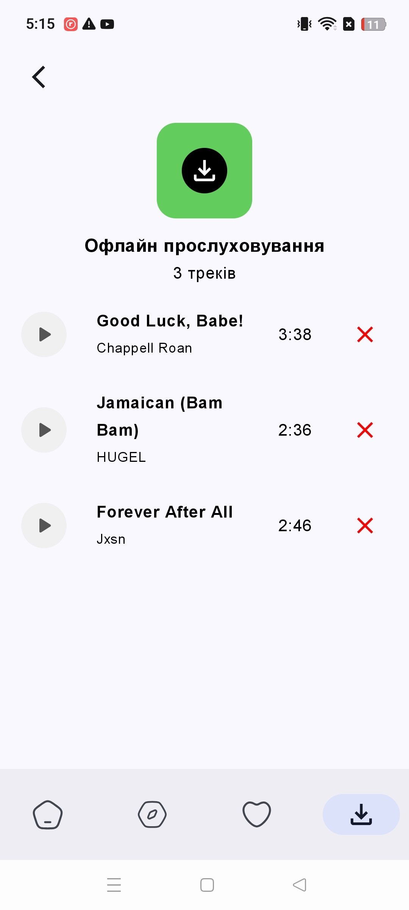

# 🎵 Lukyanoff Music

Android pet-проєкт музичного застосунку на **Kotlin + Jetpack Compose** з авторизацією, плейлистами, лайками та **офлайн-прослуховуванням**.

<p align="left">
  
  
  
  
  
  
</p>

---

## ✨ Можливості

- 🔐 **Реєстрація / Вхід / Вихід / Видалення акаунта** (Firebase Auth)
- 🎧 **Офіційні плейлисти та треки з API** (Retrofit)
- ❤️ **Liked Songs** (Firestore: збереження улюблених треків користувача)
- 📚 **Власні плейлисти** (Firestore: CRUD + додавання/видалення треків)
- 📥 **Офлайн-прослуховування**
  - завантаження preview/audio у внутрішнє сховище
  - локальна бібліотека збережених треків через **Room** (кеш/офлайн-прослуховування)
- 🧩 **MVVM + Repository**
- 🔄 Обробка станів UI: **loading / success / error** (Flow/StateFlow)

---

## 🖼️ Скріншоти

<p align="center">
  
  
  
</p>

<p align="center">
  
  
  
</p>


---

## 🧱 Стек технологій

- **Мова:** Kotlin  
- **UI:** Jetpack Compose, Material 3  
- **Архітектура:** MVVM, Repository  
- **Навігація:** Navigation Compose  
- **Мережа:** Retrofit + Gson (або інший конвертер)  
- **Асинхронність:** Coroutines, Flow / StateFlow  
- **Локальне сховище:** Room  
- **Backend:** Firebase Auth, Firebase Firestore  
- **Зображення:** Coil  

---

## 🗂️ Архітектура

Застосунок побудований за підходом **MVVM**:

- `UI (Compose)` → відображає стан та відправляє події
- `ViewModel` → зберігає UI-стан, викликає репозиторії
- `Repository` → джерела даних (Retrofit / Room / Firebase)
- `Data sources` → API / база / Firestore

Типовий потік:
`Screen → ViewModel → Repository → (API/DB/Firebase) → StateFlow → Screen`

---

## 🔌 Джерела даних

- 🌐 **Music API** (через Retrofit) — плейлисти/треки  
- 🔥 **Firebase**
  - Auth — облікові записи
  - Firestore — Liked Songs + користувацькі плейлисти
- 💾 **Room**
  - зберігає локальну бібліотеку треків користовача з посиланнями на локальний файл кожного з завантажених треків.

---

## ▶️ Запуск проєкту

### 1) Клонування
```bash
git clone https://github.com/<your-username>/lukyanoff-music.git
